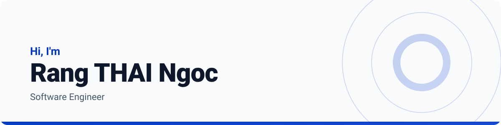

<a href="https://restom0.github.io/portfolio/website">
  <picture>
    <source media="(prefers-color-scheme: dark)" srcset="./banner-dark.svg">
    
  </picture>
</a>

Software engineer in Ho Chi Minh City. Spring Boot and NestJS services, React and Next.js clients,
and the Docker and CI plumbing that ships them.

 

---

### Built with

---

<picture>
  <source media="(prefers-color-scheme: dark)" srcset="https://github-stats-extended.vercel.app/api?username=restom0&show_icons=true&hide_border=true&hide_title=true&theme=tokyonight&bg_color=00000000">
  
</picture>
<picture>
  <source media="(prefers-color-scheme: dark)" srcset="https://github-stats-extended.vercel.app/api/top-langs/?username=restom0&layout=compact&hide_border=true&hide_title=true&theme=tokyonight&bg_color=00000000">
  
</picture>

---

